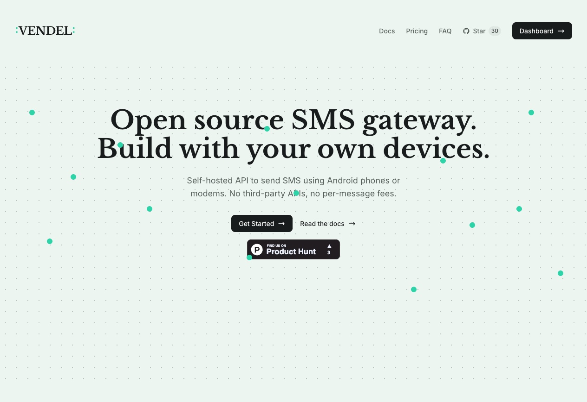

<p align="center">
  
</p>

<h1 align="center">Vendel</h1>

<p align="center">SMS Gateway Platform</p>

<p align="center">
  <a href="https://vendel.cc">Website</a> &middot;
  <a href="https://app.vendel.cc">Dashboard</a> &middot;
  <a href="./README.es.md">Leer en Español</a>
</p>

<p align="center">
  <a href="https://www.producthunt.com/products/vendel?embed=true&amp;utm_source=badge-featured&amp;utm_medium=badge&amp;utm_campaign=badge-vendel" target="_blank" rel="noopener noreferrer"></a>
</p>

Vendel is a full-stack platform for SMS management and delivery through connected devices. It allows sending SMS messages using registered devices (Android phones or modems) as gateways, with quota management, webhooks, and multi-user support.

<p align="center">
  
</p>

## Tech Stack

### Backend
- **Framework**: [PocketBase](https://pocketbase.io/) (Go)
- **Database**: SQLite (embedded)
- **Authentication**: JWT (built-in), OAuth2 (Google, GitHub)
- **Push Notifications**: Firebase Cloud Messaging (FCM)
- **Email**: Built-in SMTP support, Mailcatcher for local dev
- **Admin**: PocketBase dashboard at `/_/`

### Frontend
- **Framework**: React 19 with TypeScript
- **Build**: Vite
- **State**: TanStack Query + TanStack Router
- **Styling**: Tailwind CSS + shadcn/ui
- **Forms**: React Hook Form + Zod
- **API Client**: PocketBase JS SDK
- **E2E Tests**: Playwright

### Infrastructure
- **Backend Hosting**: Render
- **Frontend Hosting**: Cloudflare Pages
- **Containers**: Docker & Docker Compose
- **CI/CD**: GitHub Actions
- **Releases**: Tag `v*` → GHCR Docker image + Go binaries via GoReleaser

## Main Features

### SMS
- Single and bulk SMS sending
- Round-robin distribution across devices
- Message queuing when no devices are online
- Status tracking (pending, queued, processing, sent, delivered, failed)
- SMS history and reports
- Incoming SMS support

### Devices
- Device registration with unique API keys
- FCM token management for push notifications
- Device status monitoring

### Quotas and Plans
- Multiple subscription plans
- Monthly SMS quota tracking
- Device limits per plan
- Automatic monthly quota reset (cron)

### Webhooks
- Configurable webhook subscriptions per event type
- Supported events: `sms_received`, `sms_sent`, `sms_delivered`, `sms_failed`
- HMAC-SHA256 signed payloads with sorted-key JSON

### Payments
- Payment provider abstraction (QvaPay)
- Subscription lifecycle management
- Invoice and authorized payment flows

### Integrations
- Multiple API keys per user
- QR codes for device onboarding
- Public API for external systems

## Project Structure

```
vendel/
├── backend/                    # Go + PocketBase API
│   ├── main.go                 # PocketBase setup, hooks, cron, routes
│   ├── go.mod / go.sum
│   ├── handlers/               # Custom API routes (sms, plans, webhooks)
│   ├── services/               # Business logic (SMS, FCM, quota, subscriptions)
│   │   └── payment/            # Payment provider (QvaPay)
│   ├── middleware/              # API key auth, maintenance mode
│   └── migrations/             # PocketBase collection definitions + seed data
├── frontend/                   # React App
│   ├── src/
│   │   ├── routes/             # Pages (TanStack Router)
│   │   ├── components/         # React components
│   │   ├── hooks/              # Custom React hooks (PocketBase SDK)
│   │   └── lib/pocketbase.ts   # PocketBase client
│   └── tests/                  # Playwright tests
├── modem-agent/                # Go agent for USB modem gateways (AT commands)
├── Dockerfile                  # Multi-stage (node + go + alpine)
├── docker-compose.yml
├── litestream.yml              # Litestream replication config (opt-in)
├── entrypoint.sh               # Conditional startup (with/without Litestream)
└── .env                        # Environment variables
```

## Quick Start

### Prerequisites
- Docker and Docker Compose
- Go 1.23+ (for local backend dev)
- Node.js 24+ (for local frontend dev)

### Development with Docker Compose (Recommended)

```bash
# Start the app
docker compose up -d

# View logs
docker compose logs -f app
```

**Available services:**
| Service | URL |
|---------|-----|
| App (API + Frontend) | http://localhost:8090 |
| PocketBase Admin | http://localhost:8090/_/ |
| Mailcatcher | http://localhost:1080 |

### Manual Development

#### Backend
```bash
cd backend

# Run development server
go run . serve --http=0.0.0.0:8090

# Build binary
go build -o vendel .
./vendel serve --http=0.0.0.0:8090
```

#### Frontend
```bash
cd frontend

# Install dependencies
npm install

# Development server
npm run dev

# Build
npm run build

# E2E tests
npx playwright test
```

#### Modem Agent

The modem agent allows using USB LTE/4G/5G modems with a physical SIM card as SMS gateways — no Android phone needed.

```bash
cd modem-agent

# Configure modems (format: api_key:command_port[:notify_port], comma-separated)
export VENDEL_URL=http://localhost:8090
export MODEMS="your_device_api_key:/dev/ttyUSB0:/dev/ttyUSB1"

# Run
go run .
```

## Configuration

### Environment Variables

Create a `.env` file in the project root:

```env
# Core
ENVIRONMENT=local
FIRST_SUPERUSER=admin@vendel.cc
FIRST_SUPERUSER_PASSWORD=changethis

# Firebase (push notifications)
FIREBASE_SERVICE_ACCOUNT_JSON=<firebase-json>

# OAuth (optional)
GOOGLE_CLIENT_ID=
GOOGLE_CLIENT_SECRET=
GITHUB_CLIENT_ID=
GITHUB_CLIENT_SECRET=

# Payment (QvaPay)
QVAPAY_APP_ID=
QVAPAY_APP_SECRET=

# Security
WEBHOOK_ENCRYPTION_KEY=         # AES key for webhook secrets

# SMTP (defaults to localhost:1025 for mailcatcher in dev)
SMTP_HOST=
SMTP_PORT=
SMTP_USERNAME=
SMTP_PASSWORD=

# Backup (Litestream - optional)
LITESTREAM_REPLICA_URL=         # e.g. s3://my-bucket/vendel/data
LITESTREAM_ACCESS_KEY_ID=
LITESTREAM_SECRET_ACCESS_KEY=

# URLs
APP_URL=http://localhost:8090
FRONTEND_URL=http://localhost:5173    # Use APP_URL value in production
```

## Testing

### Frontend
```bash
# E2E tests
npx playwright test

# UI mode
npx playwright test --ui
```

## Deployment

- **Backend**: Deployed to [Render](https://render.com) (manual deploy)
- **Frontend**: Deployed to [Cloudflare Pages](https://pages.cloudflare.com) (manual deploy)
- **Releases**: Create a tag (`git tag v0.1.0 && git push --tags`) to publish a Docker image to GHCR and build Go binaries via GoReleaser
- **Modem Agent**: Create a tag (`git tag modem-agent/v0.1.0 && git push --tags`) to build modem agent binaries

## Related Repositories

| Repository | Description |
|------------|-------------|
| [vendel-homepage](https://github.com/JimScope/vendel-homepage) | Landing page and design system |
| [vendel-android](https://github.com/JimScope/vendel-android) | Android app (device gateway) |
| [vendel-mcp](https://github.com/JimScope/vendel-mcp) | MCP server for AI assistants |
| [vendel-sdk-js](https://github.com/JimScope/vendel-sdk-js) | JavaScript/TypeScript SDK (`vendel-sdk` on npm) |
| [vendel-sdk-python](https://github.com/JimScope/vendel-sdk-python) | Python SDK (`vendel-sdk` on PyPI) |
| [vendel-sdk-go](https://github.com/JimScope/vendel-sdk-go) | Go SDK (Go modules) |

## License

MIT License
